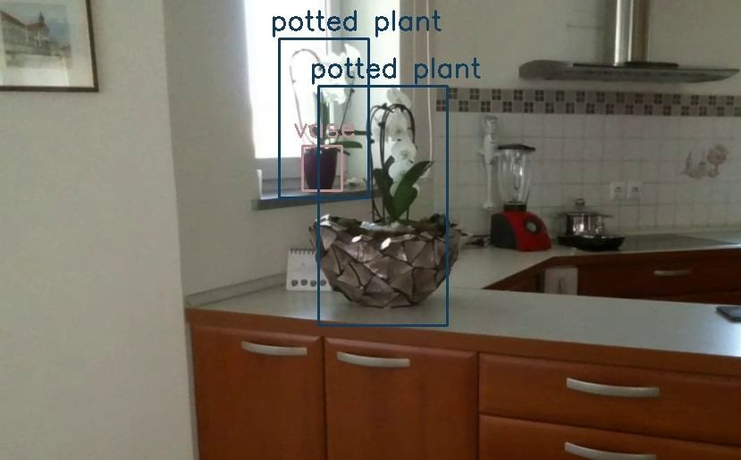

# Drone Vision
 A project for object detection with the Tello drone.


The drone used for this project was DJI Tello.


<br/>
<br/>

## How To Use It
Download the pre-trained YOLO v3 weights file to the current directory in terminal using

```
$ wget https://pjreddie.com/media/files/yolov3.weights
```

<br/>
Connect the drone with the computer via wifi and run main.py.

<br/>
<br/>

Keyboard commands for drone control:

```
ACTION ....................... KEYBOARD KEY


take off ..................... L
land ......................... Q

left ......................... left arrow
right ........................ right arrow
forward ...................... up arrow
backwards .................... down arrow
up ........................... W
down ......................... S
left rotation ................ A
right rotation ............... D
double speed ................. T (hold simultaneously with another key)
```


## Example
<p>

</p>

